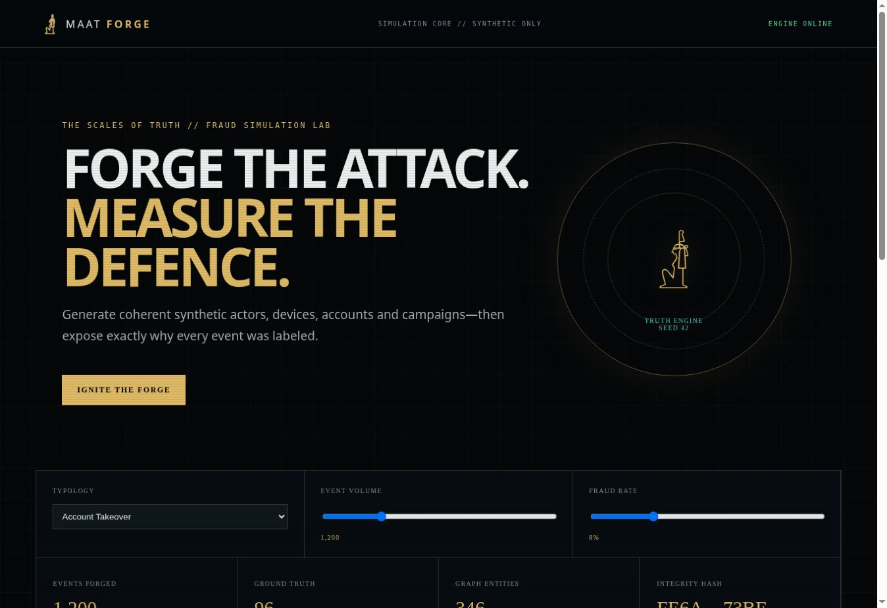

# MAAT FORGE



> Forge the attack. Measure the defence.

**MAAT FORGE** is an explainable synthetic-fraud campaign laboratory. It generates coherent accounts, devices, channels, transactions and labeled attack behavior without using customer records.

## Working alpha

- Deterministic seeds and reproducible campaign manifests.
- Account-takeover, mule-network and card-abuse typologies.
- Exact ground-truth reasons for every event.
- CSV output plus SHA-256 dataset identity.
- Interactive cinematic scenario console.
- CI tests and GitHub Pages deployment.

```bash
# Works immediately after downloading the source or ZIP:
python run.py --scenario account-takeover --events 1000 --fraud-rate .08 --seed 42

# Or install the command globally:
python -m pip install .
maat --scenario account-takeover --events 1000
```

Docker users can run `docker compose up --build`. The runtime has no third-party Python dependency.

Outputs are written to `maat-output/events.csv` and `maat-output/manifest.json`.

## Research lineage

The architecture was informed by IBM AMLSim's transaction-network simulation, SynthCity's extensible synthetic-data design, SDV's data modeling workflow, and the Fraud Detection Handbook's reproducible evaluation mindset. No third-party source code is vendored; implementation is original and MIT licensed. See `docs/REFERENCE_PROJECTS.md`.

## Responsible use

All generated identities and events are fictional. Synthetic output must never be represented as customer data, real evidence or measured production performance.

## Author

Designed and led by **Dr. Ahmed Mohamed El Sayed** — OSINT, digital forensics, cybercrime investigation, financial crime intelligence and AI-powered investigation systems.

MIT License.
